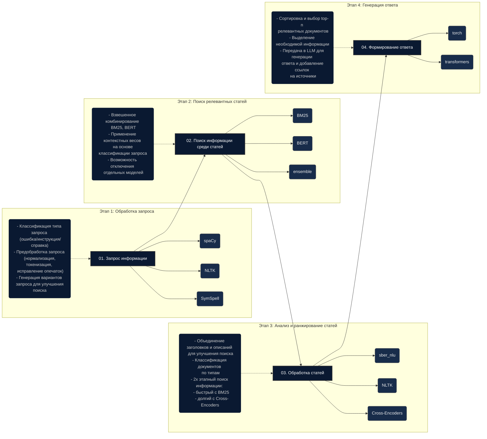

# TenderHack 2025

Проект для хакатона TenderHack 2025 - интеллектуальный чат-бот с интеграцией нейросетей.


## 📋 Описание

TenderHack2025 - это интеллектуальный помощник для работы с порталом [zakupki.mos.ru](https://zakupki.mos.ru). Ассистент помогает пользователям эффективно взаимодействовать с порталом, автоматизирует рутинные задачи и предоставляет поддержку в режиме реального времени, включая возможность быстрого соединения с живым оператором.

## 🔧 Интересные технические решения

- ✨ **Двухфакторная аутентификация** с использованием access и refresh токенов, хранящихся в [HTTP-only cookies](https://developer.mozilla.org/ru/docs/Web/HTTP/Cookies)
- 🔐 **CSRF-защита**
- 🤖 **AI-интеграция** с локальной моделью [Microsoft Phi-3-mini-4k-instruct](https://huggingface.co/microsoft/phi-3-mini-4k-instruct)
- 📈 **Асинхронное API** с использованием [FastAPI](https://fastapi.tiangolo.com/)
- 📄 **Валидация данных** через [Pydantic](https://docs.pydantic.dev/)
- 📱 **Адаптивный интерфейс**

## 📚 Используемые технологии и библиотеки

- [FastAPI](https://fastapi.tiangolo.com/) - современный высокопроизводительный веб-фреймворк
- [SQLAlchemy](https://www.sqlalchemy.org/) - SQL тулкит и ORM
- [JWT](https://jwt.io/) - безопасный механизм передачи данных в формате JSON
- [Pydantic](https://docs.pydantic.dev/) - библиотека для валидации данных
- [Jinja2](https://jinja.palletsprojects.com/) - шаблонизатор для Python
- [pandas](https://pandas.pydata.org/) - библиотека для анализа данных
- [uvicorn](https://www.uvicorn.org/) - ASGI сервер для Python
- [Passlib](https://passlib.readthedocs.io/) - библиотека для хэширования паролей
- [Microsoft Phi-3-mini-4k-instruct](https://huggingface.co/microsoft/phi-3-mini-4k-instruct) - языковая модель для локального развертывания

## Архитектура Модели ИИ-Ассистента



Я добавил этот график в ваш `README.md` файл.


## 📂 Структура проекта
=======
## Структура проекта
>>>>>>> ab1e841ccca9c4e5ac25ff73cf4895f024a7c236

```
TenderHack2025/
├── Backend/             # Телеграм-бот на aiogram
│   ├── bot.py           # Основной файл бота
│   ├── database.py      # Работа с БД через SQLAlchemy
│   ├── models.py        # Модели данных
│   ├── auth.py          # Аутентификация
│   └── Dockerfile       # Docker-файл для бэкенда
├── Neyro/               # Сервис нейросети и API
│   ├── api.py           # FastAPI сервер
│   ├── model.py         # Логика работы с моделью
│   ├── database.py      # Подключение к БД
│   └── Dockerfile       # Docker-файл для нейросервиса
├── models/              # Каталог для хранения моделей ИИ
├── docker-compose.yml   # Композиция контейнеров
├── .env                 # Файл с переменными окружения
└── README.md            # Документация
```

## Требования

- Docker и Docker Compose
- Telegram Bot API Token
- Минимум 8 ГБ RAM для работы нейросети (рекомендуется 16+ ГБ)
- Дисковое пространство для моделей (от 10 ГБ)

## Быстрый старт

1. Клонируйте репозиторий:
   ```bash
   git clone https://github.com/yourusername/TenderHack2025.git
   cd TenderHack2025
   ```

2. Создайте файл `.env` на основе примера:
   ```bash
   cp .env.example .env
   ```

3. Отредактируйте `.env` и введите ваш Telegram Bot Token:
   ```
   TG_BOT_TOKEN=your_telegram_bot_token_here
   ```

4. Запустите проект с помощью Docker Compose:
   ```bash
   docker-compose up -d
   ```

5. Проверьте статус контейнеров:
   ```bash
   docker-compose ps
   ```

## Использование нейросети

По умолчанию сервис пытается загрузить модель из каталога `models/`. Если локальная модель отсутствует, он будет использовать модель из Hugging Face Hub (необходимо подключение к интернету).

Для использования локальной модели:

1. Загрузите модель в папку `models/`:
   ```bash
   # Пример загрузки модели
   git lfs install
   git clone https://huggingface.co/meta-llama/Llama-2-7b-chat-hf models/
   ```

2. Укажите путь к модели в `.env`:
   ```
   MODEL_PATH=/app/models
   ```

## API Endpoints

Нейросервис предоставляет следующие API endpoints:

- `POST /api/ai-query` - отправка запроса к нейросети
- `POST /api/chat-history` - сохранение истории чата
- `GET /api/chat-history` - получение истории чата
- `POST /api/call-operator` - запрос на вызов оператора
- `GET /api/health` - проверка работоспособности API

## Телеграм-бот

Бот поддерживает следующие команды:

- `/start` - начать работу с ботом
- `/help` - показать справку
- `/register` - зарегистрироваться в системе
- `/login` - войти в систему
- `/chat` - начать новый чат
- `/chats` - получить список ваших чатов
- `/clear` - очистить текущий чат

## Разработка

Для разработки можно использовать следующие команды:

```bash
# Запуск только базы данных
docker-compose up -d db

# Запуск сервисов в режиме разработки
docker-compose up --build
```

## Лицензия

MIT

# Скриншоты продукта


